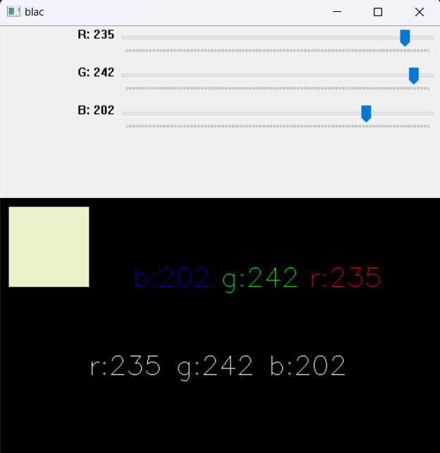

# Color-Picker-OpenCV

This project uses OpenCV to create a color picker that allows users to select a color by adjusting the values of the red, green, and blue (RGB) channels.

## Installation

To use this project, you'll need to have OpenCV and NumPy installed. You can install them using pip:

pip install opencv-python

pip install numpy

You'll also need to download the `ColorPickerCV.ipynb` file from the GitHub repository. You can do this by clicking on the "Code" button on the repository page and selecting "Download ZIP". Once you've downloaded and unzipped the file, you can open it in a Jupyter notebook.

## Usage

To use this project, simply run the `ColorPickerCV.ipynb` file in a Jupyter notebook. A window will open with trackbars for adjusting the values of the red, green, and blue channels. As you adjust the trackbars, the color of a rectangle in the window will change to reflect the selected color.

Here's a detailed explanation of how the code works:

1. The code starts by importing the necessary libraries: `cv2` and `numpy`.
2. It then creates a named window using `cv2.namedWindow()`.
3. Three callback functions are defined: `rc()`, `gc()`, and `bc()`. These functions are called when the values of the red, green, and blue trackbars are changed. They update the global variables `r`, `g`, and `b` with the current values of the trackbars.
4. Three trackbars are created using `cv2.createTrackbar()`: one for each of the red, green, and blue channels. The callback functions are passed as arguments to these functions.
5. A while loop is entered that runs until the user presses the "q" key.
6. Inside the loop, a black image is created using `np.zeros()`.
7. The current values of the red, green, and blue channels are converted to strings using `str()`.
8. These strings are concatenated together into a single string using string concatenation (`+`).
9. The concatenated string is displayed on the black image using `cv2.putText()`.
10. A rectangle is drawn on the black image using `cv2.rectangle()`. The color of this rectangle is determined by the current values of the red, green, and blue channels.
11. The black image is displayed using `cv2.imshow()`.
12. The code waits for 1 millisecond for a key press using `cv2.waitKey()`. If the "q" key is pressed, the while loop is exited.
13. After exiting the while loop, all windows are destroyed using `cv2.destroyAllWindows()`.

